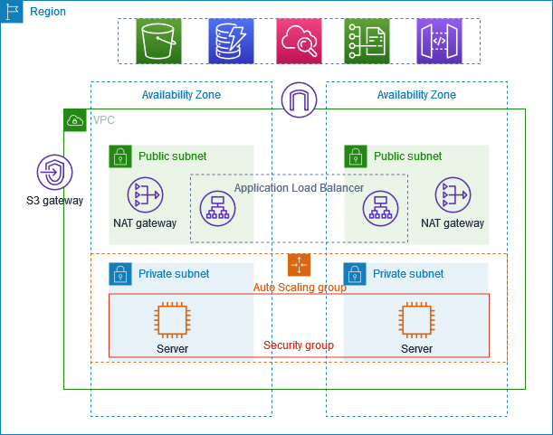
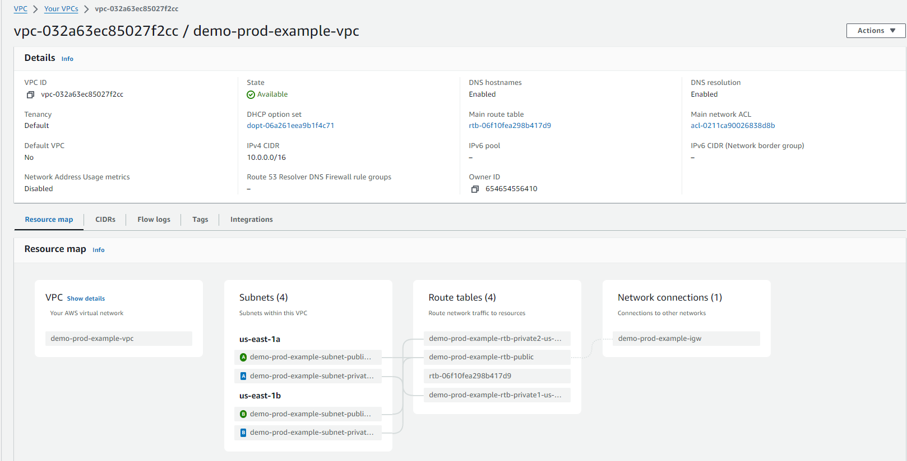
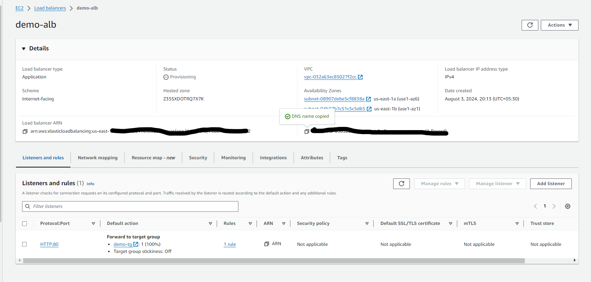

## AWS Project:

- Design and configure a VPC: Create a VPC with custom IP ranges. Set up public and private subnets. Configure route tables and associate subnets.

- Implement network security: Set up network access control lists (ACLs) to control inbound and outbound traffic. Configure security groups for EC2 instances to allow specific ports and protocols.

- Provision EC2 instances: Launch EC2 instances in both the public and private subnets. Configure security groups for the instances to allow necessary traffic. Create and assign IAM roles to the instances with appropriate permissions.

- Networking and routing: Set up an internet gateway to allow internet access for instances in the public subnet. Configure NAT gateway or NAT instance to enable outbound internet access for instances in the private subnet. Create appropriate route tables and associate them with the subnets.

- SSH key pair and access control: Generate an SSH key pair and securely store the private key. Configure the instances to allow SSH access only with the generated key pair. Implement IAM policies and roles to control access and permissions to AWS resources.

- Test and validate the setup: SSH into the EC2 instances using the private key and verify connectivity. Test network connectivity between instances in different subnets. Validate security group rules and network ACL settings.

- By implementing this project, you'll gain hands-on experience in setting up a secure VPC with EC2 instances, implementing networking and routing, configuring security groups and IAM roles, and ensuring proper access control. This project will provide a practical understanding of how these AWS services work together to create a secure and scalable infrastructure for your applications.

### Steps to create a VPC

- Choose Create VPC and select VPC and more in the VPC console. 
- In Name tag auto-generation, you can specify a prefix value for Name tags. 
- IPv4 CIDR block (default)
- Choose the number of Availability Zones (AZs) up to 3 (in this case using 2)
- The number of public and private subnet types changes based on the number of AZs and shows the total number of each subnet type it    will create
- Choose number of AZ in which to create NAT gateways (Note that there is a charge for each NAT gateway) (Not using in this project) 
- Create VPC 

- One create VPC

### Steps to create an EC2 Auto-scaling group
+ Create a launch template
+ Create a dual-instance Auto Scaling group
+ Verify your Auto Scaling group

### Steps to create a Bastian host to access EC2 instances in private subnet
- Go to the EC2 Dashboard and click Launch Instance
- Choose 'Ubuntu' or any preferred AMI
- Select 't2.micro' instance type 
- Choose keypair(login)
- Select your VPC and public subnet
- Enable Auto-assign Public IP
- Create a new security group 
- Allow 'SSH' traffic from anywhere
- Review and launch the instance

### Steps to create an Application load balancer
- Firstly create a target group
- Choose target type as EC2 instances
- Choose Target group name
- Choose protocol as 'HTTP' and port '8000'
- Choose vpc 
- Choose instances to register the targets and include them as pending

- Choose Load balancer name
- Add target group to the load balancer
- Choose Protocol as 'HTTP' and port '80' 
- Create the load balancer
- Goto newly created load balancer
- Find listeners and add a new inbound rule to allow "HTTP' traffic from security tab
- Access the final app from hitting the 'dns name' of the load balancer on the browser

## Steps to access bastian host and EC2 servers in private subnet - app deployment process
- Using MobaXterm to access bastian host and EC2 servers
- To access bastian host - we need Public IP address of the bastian host
- Use this command to upload '.pem' file to bastian host : "scp -i /home/ubuntu/filename.pem /home/ubuntu/filename.pem ubuntu@public IP:/home/ubuntu" (This is the location in my pc)
- Use this command to confirm if file uploaded : <ls | grep "file-name">
- Now login to the bastian host using the command : "ssh -i ".pem file" ubuntu@public IP"
- Use this command to check the file : "ls"
- Now login to the first private ec2 instance : "ssh -i ".pem file" ubuntu@private IP"
- Use vim command to create a index.html file: "vim index.html" that will serve as an app
- Run this command to deploy an app : "python3 -m http.server 8000"
- Access the deployed app using the 'dns name' of the load balancer

 

